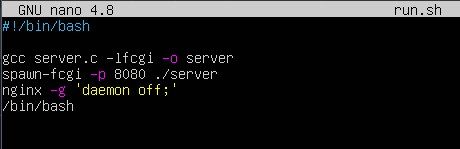
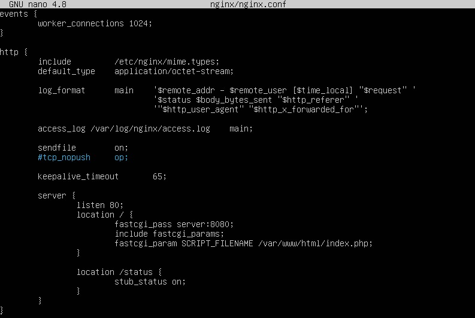

## Part 1. Готовый докер  
- Возьмем официальный докер-образ с nginx и выкачаем его при помощи
`docker pull`.    
  - `sudo docker pull nginx`      
        
- Проверим наличие докер-образа через `docker images`.  
  - `sudo docker images`    
         
- Запустим докер-образ через `docker run -d [image_id|repository]`.    
  - `sudo docker run -d nginx`  
      
- Проверим, что образ запустился через `docker ps`.
  - `sudo docker ps`  
      
- Посмотрим информацию о контейнере через `docker inspect [container_id|container_name]`.  
  - `sudo docker inspect 90e53fa45d27`  
      
- По выводу команды определим размер контейнера, список замапленных портов и ip контейнера.  
  - Размер  
      
  - Порты  
      
  - IP  
      
- Остановим докер контейнер через `docker stop [container_id|container_name]`.  
   - `sudo docker stop 90e53fa45d27`  
       
- Проверим, что контейнер остановился через `docker ps`.  
  - `sudo docker ps`  
      
- Запустим докер с портами 80 и 443 в контейнере, замапленными на такие же порты на локальной машине, через команду run.  
  - `sudo docker run -d -p 80:80 -p 443:443 nginx`  
      
- Проверим, что по адресу localhost:80 доступна стартовая страница nginx.  
  -  
- Перезапустим докер контейнер через `docker restart [container_id|container_name]`.  
  - `sudo docker restart d8581a960a61`  
      
- Проверим, что контейнер запустился.  
  - `sudo docker ps`  
      
## Part 2. Операции с контейнером  
- Прочитаем конфигурационный файл nginx.conf внутри докер контейнера через команду exec.
  - `sudo docker exec d8581a960a61 cat /etc/nginx/nginx.conf`  
      
- Создадим на локальной машине файл nginx.conf.  
  - `touch nginx.conf`  
      
- Настроим в нем по пути /status отдачу страницы статуса сервера nginx.  
  - `sudo nano nginx.conf`  
      
- Скопируем созданный файл nginx.conf внутрь докер-образа через команду `docker cp`.  
  - `sudo docker cp nginx.conf d8581a960a61:/etc/nginx/nginx.conf`  
      
- Перезапустим nginx внутри докер-образа через команду exec. 
  - `sudo docker exec d8581a960a61 nginx -s reload`  
      
- Проверим, что по адресу localhost:80/status отдается статус сервера nginx.  
  -   
- Экспортируем контейнер в файл container.tar через команду export.
  - `sudo docker export sd8581a960a61 -o container.tar`  
      
- Остановим контейнер.  
  - `sudo docker stop d8581a960a61`  
      
- Удалим образ через `docker rmi [image_id|repository]`, не удаляя перед этим контейнеры.  
  - `sudo docker rmi -f nginx`  
      
- Удалим остановленный контейнер. 
  - `sudo docker rm d8581a960a61`  
      
- Импортируем контейнер обратно через команду import.  
  - `sudo docker import -c 'CMD ["nginx", "-g", "daemon off;"]' ./container.tar nginx`  
      
- Запустим импортированный контейнер.
  - `sudo docker run -d -p 80:80 -p 443:443 nginx`   
      
- Проверим, что по адресу localhost:80/status отдается статус сервера nginx.  
  -     
## Part 3. Мини веб-сервер    
- Установим библиотеку `sudo apt-get install libfcgi-dev`  
   -   
- Напишем мини сервер на **C** и **FastCgi**, который будет возвращать `Hello World!`.   
  -   
  - `gcc server.c -lfcgi -o server`  
      
- Запустим написанный мини сервер через _spawn-fcgi_ на порту 8080.   
  - `sudo spawn-fcgi -p 8080 ./server'`  
    
- Напишим свой _nginx.conf_, который будет проксировать все запросы с 81 порта на _127.0.0.1:8080_.  
  - 
  - Запустим контейнер на порте 81 `sudo docker run -d -p 81:81 nginx`
    - 
  - Копируем туда файлы `sudo docker cp nginx.conf f1650a090779:/etc/nginx/` и `sudo docker cp server.c f1650a090779:/home`
    - 
  - Запускаем bash в контейнере `sudo docker exec -it f1650a090779 bash`
  - Устанавливаем библиотеки и утилиты из контейнера
    - `apt install gcc`
    - `apt install libfcgi-dev`
    - `apt install spawn-fcgi`
  -  Компилируем сервер в контейнере `gcc server.c -lfcgi -o server`
  - Запускаем `spawn-fcgi -p 8080 ./server`
  - Перезагружаем nginx `nginx -s reload`
- Проверим, что по localhost:81 отдается написанная нами страничка.  
  -   
- Положим файл nginx.conf по пути ./nginx/nginx.conf.  

## Part 4. Свой докер
- Напишем скрипт.
  - 
- Напишем докер образ.
  - 
- Собери написанный докер-образ через `docker build` при этом указав имя и тег.
	- `sudo docker build -t custom_image:gastonar .`
- Проверим через `docker images`, что все собралось корректно.  
	- `sudo docker images`
  - 
- Запустим собранный докер-образ с маппингом 81 порта на 80 на локальной машине и маппингом папки ./nginx внутрь контейнера по адресу, где лежат конфигурационные файлы nginx'а.
	- `sudo docker run -it -p 80:81 -v ./nginx/nginx.conf:/etc/nginx/nginx.conf -d custom_image:gastonar bash`
	- Эта команда Docker запустит контейнер, пробросив порт 81 внутри контейнера на порт 80 на моей машине. Она также подключит файл конфигурации nginx.conf к контейнеру и откроет оболочку bash для взаимодействия.
- Проверbv, что по localhost:80 доступна страничка написанного мини сервера.
  - 
- Добавим в ./nginx/nginx.conf проксирование странички /status, по которой надо отдавать статус сервера nginx.
	- 
- Перезапустим докер-образ.
	- `sudo docker restart 886d684b2c2b`
- Проверим, что теперь по localhost:80/status отдается страничка со статусом nginx
	- 
## Part 5. **Dockle**  
- Устанавливаем Dockle на Ubuntu (команды):
	- 
- Просканируем образ из предыдущего задания через `dockle [image_id|repository]`.
	- `sudo dockle custom_image:gastonar`  
		
- Исправим образ так, чтобы при проверке через dockle не было ошибок.
	- Изменим, для этого, dockerfile:  
		  
	- `sudo dockle custom_image:gastonar`  
		  
## Part 6. Базовый **Docker Compose**
- Напишем файл _docker-compose.yml_.
  - 
- Изменим файл `run.sh` чтобы контейнер не завершал работу после `docker-compose run`  
	-   
- Изменим конфиг `nginx.conf` чтобы он проксировал все с порта 8080 на порт 81  
	- 
- Остановим все запущенные контейнеры.
	- `docker stop` и `docker ps`  
		
- Соберем и запустим проект с помощью команд `docker-compose build` и `docker-compose up`.   
	-   
	-   
- Проверим, что по localhost:80 отдается написанная страничка, как и ранее. 
	-   
